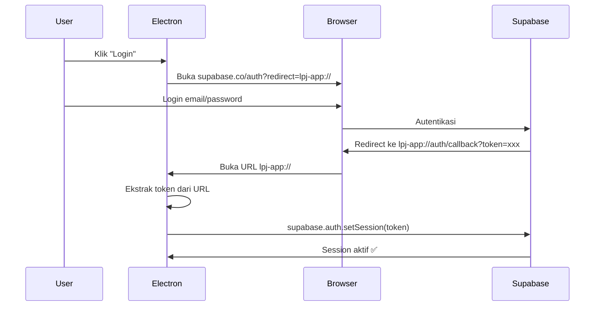

# 📊 Riset Backend: Supabase vs Alternatif untuk LPJ BOS/BOSP

> **Tanggal**: 2026-07-10
> **Tujuan**: Memilih backend yang tepat untuk aplikasi multi-sekolah (skala 1.000 sekolah)

---

## 📑 Daftar Isi

1. [✅ Keputusan Akhir: Electron + SQLite Lokal](#-keputusan-akhir-electron--sqlite-lokal)
   - [Arsitektur Final](#11-arsitektur-final)
   - [Apakah SQLite Perlu Install Terpisah?](#12-apakah-sqlite-perlu-install-terpisah)
   - [Cara Kerja Auto-Install SQLite](#13-cara-kerja-auto-install-sqlite)
   - [Dimana File Database Disimpan?](#14-dimana-file-database-disimpan)
   - [Database Migration Otomatis](#15-database-migration-otomatis)
   - [Panduan Lengkap Implementasi](#16-panduan-lengkap-implementasi)
2. [Supabase — Analisis Detail](#2-supabase--analisis-detail)
   - [Free Tier ($0/bulan)](#21-free-tier-0bulan)
   - [Pro Tier ($25/bulan)](#22-pro-tier-25bulan)
   - [Perbandingan Lengkap Free vs Pro](#23-perbandingan-lengkap-free-vs-pro)
   - [Kelebihan Supabase](#24-kelebihan-supabase)
   - [Kekurangan Supabase](#25-kekurangan-supabase)
   - [Estimasi Biaya untuk 50.000 Sekolah](#26-estimasi-biaya-untuk-50000-sekolah)
3. [Alternatif Backend Cloud](#3-alternatif-backend-cloud)
   - [PocketBase (Self-host)](#31-pocketbase-self-host)
   - [Appwrite (Cloud/Self-host)](#32-appwrite-cloudself-host)
   - [Nhost](#33-nhost)
   - [Convex](#34-convex)
   - [Perbandingan Semua Opsi Cloud](#35-perbandingan-semua-opsi-cloud)
4. [Perbandingan Akhir: Semua Arsitektur](#4-perbandingan-akhir-semua-arsitektur)
5. [Supabase + Electron Desktop App](#5-supabase--electron-desktop-app)
   - [Apakah Bisa?](#51-apakah-bisa)
   - [Cara Integrasi](#52-cara-integrasi)
   - [Tantangan & Solusi](#53-tantangan--solusi)
6. [Kesimpulan Akhir](#6-kesimpulan-akhir)

---

## ✅ Keputusan Akhir: Electron + SQLite Lokal

### 1.1 Arsitektur Final

```
┌──────────────────────────────────────────────────────────┐
│   💻 Komputer Sekolah (Instalasi Cukup 1x)               │
│                                                            │
│   ┌──────────────────────────────────────────────────┐   │
│   │  Electron Desktop App LPJ BOS/BOSP               │   │
│   │  ┌─────────────┐  ┌─────────────────────────┐   │   │
│   │  │ Main Process │  │ Renderer Process        │   │   │
│   │  │ (Node.js)    │  │ (Chromium)              │   │   │
│   │  │              │  │                         │   │   │
│   │  │ • better-    │  │ • React UI (existing)  │   │   │
│   │  │   sqlite3    │  │ • Supabase JS SDK ❌    │   │   │
│   │  │ • File I/O   │  │ • localStorage → Ganti │   │   │
│   │  │ • Print API  │  │ • Excel Parser (tetap) │   │   │
│   │  │ • IPC Bridge │  │ • Template Engine(tetap)│   │   │
│   │  └──────┬───────┘  └───────────┬─────────────┘   │   │
│   │         │                      │                   │   │
│   │         └──────────IPC─────────┘                   │   │
│   │                                                     │   │
│   │  ┌─────────────────────────────────────────────┐   │   │
│   │  │ 📁 User Data Folder (auto-dibuat)            │   │   │
│   │  │   C:/Users/[Nama]/AppData/Roaming/lpj-bosbosp/│   │   │
│   │  │                                              │   │   │
│   │  │   ├── lpj_bosbosp.db    ← SQLite database    │   │   │
│   │  │   ├── uploads/          ← File Excel asli    │   │   │
│   │  │   ├── templates/        ← Template DOCX      │   │   │
│   │  │   └── exports/          ← Hasil ekspor PDF   │   │   │
│   │  └─────────────────────────────────────────────┘   │   │
│   └──────────────────────────────────────────────────┘   │
│                                                            │
│   🔌 TIDAK PERLU INTERNET ✅   🛡️ DATA LOKAL ✅          │
└──────────────────────────────────────────────────────────┘

┌──────────────────────────────────────────────────────────┐
│   💻 Komputer Sekolah Lain (instalasi mandiri)            │
│   ┌──────────────────────────────────────────────────┐   │
│   │  SAMA PERSIS — database TERPISAH otomatis         │   │
│   │  Tidak ada data tercampur antar sekolah           │   │
│   └──────────────────────────────────────────────────┘   │
└──────────────────────────────────────────────────────────┘

...hingga 1.000 sekolah, masing-masing punya database sendiri.
```

### 1.2 Apakah SQLite Perlu Install Terpisah?

**TIDAK. Sama sekali tidak perlu.**

Ini pertanyaan yang sangat penting dan jawabannya adalah:

| Kekhawatiran | Realita |
|:-------------|:--------|
| "Apakah user harus install SQLite dulu?" | ❌ **Tidak.** SQLite sudah terbundel di dalam installer |
| "Apakah perlu download SQLite dari website?" | ❌ **Tidak.** Semua sudah termasuk dalam file `.exe` |
| "Apakah perlu setting PATH?" | ❌ **Tidak.** Tidak ada PATH atau environment variable |
| "Apakah perlu install Visual C++ Redist?" | ⚠️ **Mungkin** — tapi electron-builder otomatis handle ini |
| "Apakah perlu CONFIG manual?" | ❌ **Tidak.** Database langsung auto-created saat app pertama kali jalan |

#### Kenapa SQLite Tidak Perlu Install Terpisah?

Karena kita menggunakan **`better-sqlite3`** — yaitu:

```
better-sqlite3 = Node.js wrapper + SQLite C library (sudah termasuk)
                        ↓
Di-compile jadi file .node (native addon) saat build
                        ↓
Terbundel di dalam folder resources Electron app
                        ↓
User tinggal jalankan .exe → SQLite langsung siap pakai
```

Bukan SQLite "server" seperti MySQL atau PostgreSQL yang perlu install service sendiri.

### 1.3 Cara Kerja Auto-Install SQLite

Saat user menjalankan installer:

```
User download LPJ_BOSBOSP_Setup_v1.0.0.exe (ukuran ~80-150MB)
                              │
                              ▼
User klik "Next → Next → Finish" (instalasi normal)
                              │
                              ▼
Aplikasi terinstall di C:/Program Files/LPJ BOSBOSP/
  ├── electron.exe
  ├── resources/
  │   └── app.asar          ← Berisi semua kode + better-sqlite3 (.node)
  └── ...
                              │
                              ▼
User klik shortcut "LPJ BOSBOSP" di Desktop
                              │
                              ▼
┌────────────────────────────────────────────────────┐
│  Electron START — Main Process                     │
│                                                     │
│  1. const dbPath = app.getPath('userData') + '/db' │
│  2. Cek: apakah file database.sqlite sudah ada?    │
│  3. Jika TIDAK → Buat folder & file database baru  │
│  4. Jalankan migration (CREATE TABLE, dll)         │
│  5. Database SIAP PAKAI dalam < 1 detik            │
│  6. Kirim sinyal ke Renderer → "Database siap ✅"  │
└────────────────────────────────────────────────────┘
                              │
                              ▼
User langsung lihat halaman Login/Dashboard 🎉
```

**Kode konkretnya:**

```javascript
// main.js — Electron Main Process
const { app } = require('electron')
const path = require('path')
const Database = require('better-sqlite3')

let db

app.whenReady().then(() => {
  // 📁 1. Tentukan lokasi database — otomatis di folder user
  const userDataPath = app.getPath('userData')
  // Windows: C:/Users/[Nama]/AppData/Roaming/lpj-bosbosp/
  // macOS:   ~/Library/Application Support/lpj-bosbosp/
  // Linux:   ~/.config/lpj-bosbosp/

  // 📁 2. Buat folder jika belum ada (otomatis)
  const dbDir = path.join(userDataPath, 'database')
  if (!require('fs').existsSync(dbDir)) {
    require('fs').mkdirSync(dbDir, { recursive: true })
  }

  // 💾 3. Buat/Sambungkan ke SQLite database
  //     Jika file belum ada → DIBUAT OTOMATIS
  //     Jika file sudah ada → LANGSUNG DIPAKAI
  db = new Database(path.join(dbDir, 'lpj_bosbosp.db'))

  // 🚀 4. Jalankan migration — buat tabel-tabel
  db.exec(`
    CREATE TABLE IF NOT EXISTS sekolah (
      id INTEGER PRIMARY KEY,
      npsn TEXT,
      nama_sekolah TEXT,
      alamat TEXT,
      kecamatan TEXT,
      kabupaten TEXT,
      provinsi TEXT,
      tahun_anggaran TEXT,
      created_at TEXT DEFAULT (datetime('now'))
    );

    CREATE TABLE IF NOT EXISTS pejabat (
      id INTEGER PRIMARY KEY,
      sekolah_id INTEGER,
      jabatan TEXT,
      nama TEXT,
      nip TEXT,
      FOREIGN KEY (sekolah_id) REFERENCES sekolah(id)
    );

    CREATE TABLE IF NOT EXISTS guru (
      id INTEGER PRIMARY KEY,
      nama TEXT,
      nip TEXT,
      nuptk TEXT,
      status TEXT,
      golongan TEXT,
      jabatan TEXT
    );

    CREATE TABLE IF NOT EXISTS tendik (
      id INTEGER PRIMARY KEY,
      nama TEXT,
      nip TEXT,
      nuptk TEXT,
      status TEXT,
      jenis_ptk TEXT
    );

    CREATE TABLE IF NOT EXISTS bku_transaksi (
      id INTEGER PRIMARY KEY,
      tanggal TEXT,
      uraian TEXT,
      kode_kegiatan TEXT,
      kode_rekening TEXT,
      no_bukti TEXT,
      penerimaan REAL DEFAULT 0,
      pengeluaran REAL DEFAULT 0,
      saldo REAL DEFAULT 0,
      tipe TEXT,
      bulan INTEGER,
      tahun INTEGER
    );

    CREATE TABLE IF NOT EXISTS dokumen_lpj (
      id INTEGER PRIMARY KEY,
      card_id TEXT,
      sub_id TEXT,
      status TEXT DEFAULT 'Belum',
      data_json TEXT,
      updated_at TEXT DEFAULT (datetime('now'))
    );

    CREATE TABLE IF NOT EXISTS dokumen_kelengkapan (
      id TEXT PRIMARY KEY,
      status TEXT DEFAULT 'Belum'
    );

    CREATE TABLE IF NOT EXISTS catatan (
      id INTEGER PRIMARY KEY,
      title TEXT,
      content TEXT,
      category TEXT,
      color TEXT,
      is_pinned INTEGER DEFAULT 0,
      created_at TEXT,
      updated_at TEXT
    );

    CREATE TABLE IF NOT EXISTS pengaturan (
      key TEXT PRIMARY KEY,
      value TEXT
    );
  `)

  console.log('✅ Database siap di:', dbDir)
})
```

### 1.4 Dimana File Database Disimpan?

| OS | Path | Contoh |
|:---|:-----|:-------|
| **Windows** | `%APPDATA%/lpj-bosbosp/` | `C:/Users/Operator/AppData/Roaming/lpj-bosbosp/database/lpj_bosbosp.db` |
| **macOS** | `~/Library/Application Support/lpj-bosbosp/` | `/Users/operator/Library/Application Support/lpj-bosbosp/database/lpj_bosbosp.db` |
| **Linux** | `~/.config/lpj-bosbosp/` | `/home/operator/.config/lpj-bosbosp/database/lpj_bosbosp.db` |

**Akses untuk user:** File database bisa diakses langsung dengan **DB Browser for SQLite** (free tool) jika ingin melihat/mengedit data manual.

### 1.5 Database Migration Otomatis

Setiap kali aplikasi di-update ke versi baru, migration dijalankan otomatis:

```javascript
// migrations.js — Auto migration system
const DB_VERSION_KEY = 'db_version'
const CURRENT_VERSION = 2

function runMigrations(db) {
  const currentVersion = db.prepare(
    `SELECT value FROM pengaturan WHERE key = ?`
  ).get(DB_VERSION_KEY)?.value || 0

  if (currentVersion < 1) {
    db.exec(`CREATE TABLE IF NOT EXISTS ...`) // migration v1
    db.prepare(`INSERT OR REPLACE INTO pengaturan (key, value) VALUES (?, ?)`)
      .run(DB_VERSION_KEY, '1')
  }

  if (currentVersion < 2) {
    db.exec(`ALTER TABLE guru ADD COLUMN ...`) // migration v2
    db.prepare(`INSERT OR REPLACE INTO pengaturan (key, value) VALUES (?, ?)`)
      .run(DB_VERSION_KEY, '2')
  }

  // ... dan seterusnya
}
```

### 1.6 Panduan Lengkap Implementasi

#### Package.json

```json
{
  "name": "lpj-bosbosp",
  "version": "1.0.0",
  "main": "electron/main.js",
  "scripts": {
    "dev": "vite",
    "build": "vite build",
    "electron:dev": "concurrently \"vite\" \"wait-on http://localhost:5173 && electron .\"",
    "electron:build": "vite build && electron-builder",
    "postinstall": "electron-builder install-app-deps"
  },
  "dependencies": {
    "better-sqlite3": "^11.0.0",
    "react": "^18.3.0",
    "react-dom": "^18.3.0",
    "xlsx": "^0.18.0"
  },
  "devDependencies": {
    "@vitejs/plugin-react": "^4.3.0",
    "electron": "^31.0.0",
    "electron-builder": "^24.13.0",
    "vite": "^5.4.0",
    "concurrently": "^8.2.0",
    "wait-on": "^7.2.0"
  },
  "build": {
    "appId": "com.lpj-bosbosp.app",
    "productName": "LPJ BOS/BOSP",
    "directories": {
      "output": "dist-electron"
    },
    "files": [
      "dist/**/*",
      "electron/**/*",
      "node_modules/better-sqlite3/**/*"
    ],
    "win": {
      "target": "nsis",
      "icon": "build/icon.ico"
    },
    "nsis": {
      "oneClick": false,
      "allowToChangeInstallationDirectory": true,
      "createDesktopShortcut": true
    }
  }
}
```

#### Struktur Folder Electron

```
spj-app/
├── electron/
│   ├── main.js            ← Main process (Node.js + better-sqlite3)
│   ├── preload.js          ← Bridge IPC (renderer ↔ main)
│   ├── database.js         ← Semua query SQLite
│   └── migrations.js       ← Auto migration system
├── src/
│   └── ... (React existing, tidak berubah banyak)
├── package.json
└── vite.config.js
```

#### Bridge IPC — Renderer ↔ SQLite

```javascript
// electron/preload.js
const { contextBridge, ipcRenderer } = require('electron')

contextBridge.exposeInMainWorld('api', {
  // Data Sekolah
  getSekolah: () => ipcRenderer.invoke('db:sekolah:get'),
  saveSekolah: (data) => ipcRenderer.invoke('db:sekolah:save', data),

  // Guru
  getGuru: () => ipcRenderer.invoke('db:guru:getAll'),
  saveGuru: (items) => ipcRenderer.invoke('db:guru:saveAll', items),

  // BKU
  getBKU: () => ipcRenderer.invoke('db:bku:getAll'),
  saveBKU: (data) => ipcRenderer.invoke('db:bku:save', data),

  // Dokumen LPJ
  getDokumenLPJ: () => ipcRenderer.invoke('db:dokumen:lpj:get'),
  saveDokumenLPJ: (data) => ipcRenderer.invoke('db:dokumen:lpj:save', data),

  // Catatan
  getNotes: () => ipcRenderer.invoke('db:notes:getAll'),
  saveNotes: (notes) => ipcRenderer.invoke('db:notes:saveAll', notes),

  // Utility
  exportData: () => ipcRenderer.invoke('db:export'),
  importData: (filePath) => ipcRenderer.invoke('db:import', filePath),
})
```

#### Perubahan di Kode React

Yang berubah hanya `storageHelper.js` — dari localStorage ke IPC:

```javascript
// Before — localStorage
export const storageHelper = {
  get(key, defaultValue = null) {
    const raw = localStorage.getItem('spj_' + key)
    return raw ? JSON.parse(raw) : defaultValue
  },
  set(key, value) {
    localStorage.setItem('spj_' + key, JSON.stringify(value))
  },
}

// After — SQLite via IPC
export const storageHelper = {
  async get(key, defaultValue = null) {
    // Untuk development (web), fallback ke localStorage
    if (!window.api) {
      const raw = localStorage.getItem('spj_' + key)
      return raw ? JSON.parse(raw) : defaultValue
    }
    // Untuk production (Electron), panggil SQLite
    return await window.api['get' + capitalize(key)]() || defaultValue
  },
  async set(key, value) {
    if (!window.api) {
      localStorage.setItem('spj_' + key, JSON.stringify(value))
      return
    }
    await window.api['save' + capitalize(key)](value)
  },
}
```

### 1.7 Kelebihan Arsitektur Ini

| # | Kelebihan | Dampak untuk 1.000 Sekolah |
|:-:|:----------|:---------------------------|
| 1 | **Gratis total** | Tidak ada biaya server, database, atau hosting |
| 2 | **Instalasi 1x klik** | User cukup download .exe → next → finish |
| 3 | **SQLite auto-install** | Tidak perlu install database terpisah |
| 4 | **Database auto-created** | File `.db` langsung dibuat saat pertama kali buka app |
| 5 | **Offline 100%** | Bisa kerja di daerah tanpa internet |
| 6 | **Data aman** | Tidak ada data sekolah yang dikirim ke server manapun |
| 7 | **Backup semudah copy-paste** | Copy file `.db` ke flashdisk = backup total |
| 8 | **Performa super cepat** | Query ke file lokal, tanpa network latency |
| 9 | **Update mudah** | Auto migration database saat versi baru |
| 10 | **Skalabilitas horizontal** | 1.000 sekolah = 1.000 file `.db` independen |

### 1.8 Kekurangan & Mitigasi

| # | Kekurangan | Mitigasi |
|:-:|:-----------|:---------|
| 1 | **Tidak ada sync antar perangkat** | Sesuai skenario 1 komputer/sekolah. Jika butuh sync, bisa tambah fitur export/import JSON nantinya |
| 2 | **Risiko kehilangan data jika komputer rusak** | Edukasi user untuk backup berkala. Bisa tambah reminder otomatis |
| 3 | **Ukuran installer ~100MB** (termasuk Chromium) | Wajar untuk Electron app. Bisa kompres dengan UPX |
| 4 | **Native module better-sqlite3** | `postinstall: electron-builder install-app-deps` otomatis handle rebuild |
| 5 | **Tidak bisa akses dari HP** | Desktop only — memang untuk operator sekolah |

---

## 2. Supabase — Analisis Detail

### 2.1 Free Tier ($0/bulan)

Supabase Free Tier adalah salah satu yang paling generous di kelas BaaS (Backend-as-a-Service).

#### ✅ Termasuk:
| Sumber Daya | Batasan | Catatan |
|:------------|:-------:|:--------|
| **Database** | **500 MB** PostgreSQL | Termasuk extensions (PostGIS, pgvector, dll) |
| **Auth Users (MAU)** | **50.000** monthly active users | Bukan total registered users, tapi yang login dalam sebulan |
| **File Storage** | **1 GB** | Untuk upload file Excel BKU, dll |
| **Bandwidth (Egress)** | **5 GB/bulan** | Traffic keluar dari database + storage |
| **API Requests** | Tidak dibatasi secara eksplisit | Dibatas oleh CPU/memory sharing |
| **Realtime** | **200 concurrent connections** | Untuk fitur realtime |
| **Projects** | **2 project aktif** | Bisa 1 production + 1 development |
| **Backup** | **Snapshot 7 hari** (point-in-time) | Tidak bisa restore manual |
| **SSL/HTTPS** | ✅ Included | Otomatis |
| **CDN** | ✅ Included | Untuk file storage |

#### ❌ Tidak Termasuk:
- ❌ **Support prioritas** — Hanya community support (GitHub Discord)
- ❌ **Auto-pause** — Project akan **pause otomatis setelah 7 hari tidak aktif**
- ❌ **Custom domain** — Harus pakai subdomain `.supabase.co`
- ❌ **Advanced monitoring** — Hanya dashboard dasar
- ❌ **SOC2 compliance**
- ❌ **SLA (Service Level Agreement)**

#### ⚠️ Masalah KRITIS: Auto-Pause

```
Project tidak diakses → 7 hari → DATABASE PAUSE
                                    ↓
Ada user login → Klik "Restore" di dashboard
                                    ↓
Tunggu 30-60 detik → Database aktif lagi
```

**Dampak untuk sekolah Indonesia:**
- Operator sekolah mungkin hanya mengakses aplikasi **1-2 minggu sekali**
- Deadline LPJ biasanya **per semester** (6 bulan)
- Jika database pause saat mau cetak LPJ, operator harus menunggu restore
- Proses restore **tidak otomatis** — harus login ke Supabase dashboard

### 2.2 Pro Tier ($25/bulan)

#### ✅ Termasuk:
| Sumber Daya | Batasan | Catatan |
|:------------|:-------:|:--------|
| **Database** | **8 GB** PostgreSQL | 16x lipat dari Free |
| **Auth Users (MAU)** | **100.000** | 2x lipat dari Free |
| **File Storage** | **100 GB** | 100x lipat dari Free |
| **Bandwidth (Egress)** | **250 GB/bulan** | 50x lipat dari Free |
| **Realtime** | **500 concurrent connections** | |
| **Projects** | **Unlimited** | Bayar per project |
| **Backup** | **Daily backups** (7 hari retention) | ✅ Aman |
| **Auto-pause** | ✅ **TIDAK ADA** | Selalu aktif |
| **Custom domain** | ✅ Included | |
| **Email support** | ✅ Prioritized | |

#### 💰 Additional Usage (Pay-as-you-go):

| Sumber Daya | Harga Tambahan |
|:------------|:--------------:|
| MAU tambahan | **$0.00325/user** (>100rb) |
| Storage tambahan | **$0.021/GB** (>100GB) |
| Bandwidth tambahan | **$0.09/GB** (>250GB) |
| Database size tambahan | **$0.021/GB** (>8GB) |

### 2.3 Perbandingan Lengkap Free vs Pro

| Fitur | Free ($0) | Pro ($25/bln) |
|:------|:---------:|:-------------:|
| **Harga** | $0/bulan | $25/bulan + usage |
| **Database** | PostgreSQL 500 MB | PostgreSQL 8 GB |
| **Auth MAU** | 50.000 | 100.000 |
| **File Storage** | 1 GB | 100 GB |
| **Bandwidth** | 5 GB/bln | 250 GB/bln |
| **Projects** | 2 | Unlimited |
| **Auto-pause** | ⚠️ **Ya** (7 hari) | ✅ **Tidak** |
| **Backup** | Snapshot 7 hari | Daily backup 7 hari |
| **Custom Domain** | ❌ | ✅ |
| **Support** | Community | Email prioritas |
| **SLA** | ❌ | ✅ |
| **SOC2** | ❌ | ✅ (add-on) |
| **Branching DB** | ❌ | ✅ |
| **Read Replicas** | ❌ | ✅ (add-on) |

### 2.4 Kelebihan Supabase

| # | Kelebihan | Penjelasan |
|:-:|:-----------|:-----------|
| 1 | **PostgreSQL murni** | Bukan NoSQL tiruan. Bisa pakai SQL penuh, JOIN, trigger, function, extension |
| 2 | **Row Level Security (RLS)** | ⭐ **BEST IN CLASS** untuk multi-tenant. Tulis policy SQL per baris data |
| 3 | **Realtime built-in** | Subscribe ke perubahan database secara langsung tanpa WebSocket manual |
| 4 | **Auth lengkap** | Email/password, Google, GitHub, magic link, SMS, OAuth, SSO |
| 5 | **File Storage** | S3-compatible, langsung terintegrasi dengan RLS |
| 6 | **Edge Functions** | Deno-based serverless functions, bisa di edge (latensi rendah untuk Indonesia) |
| 7 | **Auto-generated REST API** | Dari tabel → langsung REST endpoint. Tidak perlu coding API |
| 8 | **TypeScript SDK** | Type-safe, auto-complete, dokumentasi bagus |
| 9 | **Dashboard web** | UI untuk manage database, auth, storage tanpa SQL |
| 10 | **Ekstensi PostgreSQL** | PostGIS (geo/lokasi sekolah), pgvector (AI search) |

#### RLS (Row Level Security) — Contoh untuk Multi-Sekolah:

```sql
-- Policy: User hanya bisa melihat data sekolahnya sendiri
CREATE POLICY "Users can view their own school data"
ON sekolah
FOR SELECT
USING (
  id = auth.jwt() ->> 'school_id'
);

-- Policy: Operator hanya bisa edit data sekolahnya
CREATE POLICY "Operators can update their school"
ON sekolah
FOR UPDATE
USING (
  id = auth.jwt() ->> 'school_id'
);
```

### 2.5 Kekurangan Supabase

| # | Kekurangan | Dampak |
|:-:|:-----------|:-------|
| 1 | **Auto-pause di Free Tier** | ⚠️ Project mati setelah 7 hari idle. Restore manual 30-60 detik |
| 2 | **Database 500MB Free** | Cukup untuk ~4.500 sekolah. 50.000 sekolah butuh ~5.5GB → Pro |
| 3 | **Tidak ada backup di Free** | Jika data corrupt, tidak bisa restore. Risiko total |
| 4 | **Vendor lock-in** | Walau PostgreSQL, beberapa fitur (auth, storage, realtime) proprietary |
| 5 | **Kunci API di public** | SDK client-side berarti anon key ada di kode frontend. Keamanan harus di RLS |
| 6 | **Bandwidth 5GB Free** | Cepat habis jika sering download file Excel |
| 7 | **Self-host sangat sulit** | Supabase self-host butuh Kubernetes + Docker + banyak service |
| 8 | **Pro $25/project** | Multiple project = multiple $25. Tidak bisa 1 proyek untuk semua |
| 9 | **Kurang cocok offline** | Butuh koneksi internet untuk auth & database |
| 10 | **Pricing naik seiring usage** | MAU + storage + bandwidth bisa membengkak |

### 2.6 Estimasi Biaya untuk 50.000 Sekolah

#### Skenario A: Semua Online (Real-time cloud)

| Item | Free ($0) | Pro ($25) + Additional |
|:-----|:---------:|:----------------------:|
| **Database** | ❌ 500MB cukup hanya 4.500 sekolah | 8GB → 72rb sekolah ✅ |
| **Storage** | ❌ 1GB cukup 5.000 file | 100GB + 9GB tambahan ✅ |
| **Bandwidth** | ❌ 5GB | 250GB ✅ (estimasi 5MB/sekolah/bulan) |
| **MAU** | ✅ 50.000 | ✅ 100.000 |
| **Auto-pause** | ❌ Sangat mengganggu | ✅ Tidak ada |

**Total per Bulan:**
- Free: **$0** (tapi auto-pause + storage tidak cukup)
- Pro: **$25** ≈ **Rp400.000/bulan** (cukup untuk 50.000 sekolah)
- Pro + extra storage: ~**$27-30/bulan**

**WAJIB DIINGAT:** Supabase Pro dihitung **per project**. Jika butuh multi-project (misal per region/provinsi), biaya = $25 × jumlah project.

---

## 3. Alternatif Backend Cloud

### 3.1 PocketBase (Self-host)

#### 📋 Spesifikasi

| Atribut | Nilai |
|:--------|:------|
| **Model** | Single Go binary |
| **Database** | SQLite (embedded) |
| **Auth** | Built-in (email, OAuth2, Google, GitHub) |
| **File Storage** | Local disk (sesuai kapasitas VPS) |
| **Realtime** | ✅ Built-in (SSE) |
| **API** | REST auto-generated + SDK |
| **Admin UI** | ✅ Built-in web dashboard |
| **Hooks** | JS/Go untuk business logic |

#### ✅ Kelebihan

| # | Kelebihan | Detail |
|:-:|:-----------|:-------|
| 1 | ⭐ **Setup 5 menit** | Download 1 binary → `./pocketbase serve` → jadi |
| 2 | **Gratis total** | Cuma bayar VPS. 50rb sekolah tetap $10-15/bln |
| 3 | **Backup gampang** | Copy file `pb_data/data.db` aja |
| 4 | **Offline-friendly** | SQLite file-based, bisa di-copy ke flashdisk |
| 5 | **Admin UI built-in** | `/_/` — dashboard lengkap untuk CRUD |
| 6 | **Ringan** | Binary ~30MB, RAM ~50MB idle |
| 7 | **No vendor lock-in** | SQLite murni, bisa dibuka dengan DB Browser |
| 8 | **Cocok untuk Indonesia** | Bisa jalan di VPS murah (DigitalOcean $6, Vultr $5) |

#### ❌ Kekurangan

| # | Kekurangan | Dampak |
|:-:|:-----------|:-------|
| 1 | **SQLite** — tidak se-powerful PostgreSQL | Tidak support concurrent write tinggi |
| 2 | **Tidak ada RLS native** | Filter data per sekolah manual via API Rules |
| 3 | **Single server** — tidak bisa horizontal scaling | Tapi SQLite kuat sampai 100GB+ |
| 4 | **Ekosistem lebih kecil** | Lebih sedikit tutorial/komunitas dibanding Supabase |
| 5 | **Auth terbatas** | Tidak ada SSO, SAML, atau multi-factor auth |
| 6 | **Tidak ada realtime native** | Ada SSE tapi tidak sebagus Supabase Realtime |

### 3.2 Appwrite (Cloud/Self-host)

#### 📋 Spesifikasi

| Atribut | Nilai |
|:--------|:------|
| **Model** | Microservices (Docker) |
| **Database** | MariaDB + NoSQL-style collections |
| **Auth** | Built-in (email, OAuth2, phone, magic link, SAML) |
| **File Storage** | Built-in + CDN |
| **Realtime** | ✅ Built-in |
| **Functions** | ✅ Serverless (Node.js, Python, PHP, Ruby, Dart) |
| **Admin UI** | ✅ Built-in dashboard |

#### ✅ Kelebihan

| # | Kelebihan | Detail |
|:-:|:-----------|:-------|
| 1 | **Fitur terlengkap** | Paling mendekati Supabase dalam hal feature parity |
| 2 | **Multi-tenant via Teams** | Built-in team management + permissions |
| 3 | **Free tier 75k MAU** | Lebih banyak dari Supabase (50k) |
| 4 | **Self-host mudah** | `docker run appwrite/appwrite` langsung jadi |
| 5 | **File preview** | Preview gambar, PDF, video langsung di dashboard |
| 6 | **SDK multi-bahasa** | Web, Flutter, Android, iOS, Python, PHP, Node.js |
| 7 | **GraphQL support** | Alternatif REST |

#### ❌ Kekurangan

| # | Kekurangan | Dampak |
|:-:|:-----------|:-------|
| 1 | **Docker wajib** | Tidak bisa langsung jalan seperti PocketBase |
| 2 | **Resource heavy** | Butuh minimal 2GB RAM, 20GB disk |
| 3 | **Database MariaDB** | Tidak sefleksibel PostgreSQL untuk query kompleks |
| 4 | **Multi-tenant tidak serapi RLS** | Harus konfigurasi manual via Teams |
| 5 | **Self-host lebih kompleks** | 12+ container vs PocketBase 1 binary |

### 3.3 Nhost

#### 📋 Spesifikasi

| Atribut | Nilai |
|:--------|:------|
| **Model** | Managed + Self-host (Docker) |
| **Database** | PostgreSQL + Hasura GraphQL |
| **Auth** | Built-in (email, OAuth2, SMS, magic link) |
| **File Storage** | ✅ Built-in |
| **Realtime** | ✅ Via Hasura subscriptions |
| **Functions** | ✅ Serverless (Node.js, TypeScript) |

#### Kelebihan:
- ⭐ **PostgreSQL + Hasura** — Multi-tenant terbaik
- ⭐ **Auto-generated GraphQL API** — Query fleksibel
- ⭐ **Hasura permissions** — Setara RLS Supabase
- Auto SSL, custom domain
- Free tier: 2GB database, 2GB storage, 50k MAU

#### Kekurangan:
- ❌ Relatif baru — komunitas masih kecil
- ❌ Self-host kompleks (butuh Kubernetes)
- ❌ Pricing cloud lebih mahal dari Supabase
- ❌ GraphQL learning curve untuk tim yang tidak familiar

### 3.4 Convex

#### 📋 Spesifikasi

| Atribut | Nilai |
|:--------|:------|
| **Model** | Managed cloud only (tidak bisa self-host) |
| **Database** | Proprietary (reactive document-store) |
| **Auth** | Built-in (email, OAuth2, JWT) |
| **Functions** | ✅ Serverless (TypeScript) |
| **Realtime** | ✅ Native (reactive queries) |

#### Kelebihan:
- ⭐ **Developer experience luar biasa** — TypeScript-first
- ⭐ **Reactive by default** — Setiap query otomatis realtime
- ⭐ **Schema validation built-in**
- ⭐ **Zero config** — Column otomatis terdeteksi

#### Kekurangan:
- ❌ **Managed only** — Tidak bisa self-host
- ❌ **Vendor lock-in tinggi** — Database proprietary
- ❌ **Mahal untuk scale** — Pricing per compute, storage, bandwidth
- ❌ **Tidak cocok offline**
- ❌ **Tidak ada Row Level Security** — Semua via fungsi

### 3.5 Perbandingan Semua Opsi Cloud

| Kriteria | **PocketBase** 🥇 | **Appwrite** 🥈 | **Supabase** | **Nhost** | **Convex** |
|:---------|:---:|:---:|:---:|:---:|:---:|
| **Setup termudah** | 🟢🟢 **1 file** | 🟡 Docker | 🟢 Cloud | 🟢 Cloud | 🟢 Cloud |
| **Self-host** | ✅ Mudah | ✅ Docker | ⚠️ Sulit | ⚠️ Sulit | ❌ |
| **Gratis 50rb user** | ✅ **Gratis total** | ⚠️ 75k MAU | ✅ 50k MAU | ⚠️ Limited | ⚠️ Starter |
| **Multi-tenant** | 🟡 Manual | 🟡 Teams | 🟢 **RLS** | 🟢🟢 **Hasura** | 🟡 Fungsi |
| **Biaya/bln 50rb sekolah** | **$6-12** | **$15-20** | **~$500** | **~$200** | **Mahal** |
| **PostgreSQL** | ❌ SQLite | ❌ MariaDB | ✅ | ✅ | ❌ |
| **Real-time** | 🟡 SSE | ✅ | ✅✅ | ✅✅ | ✅✅✅ |
| **Backup mudah** | ✅ Copy file | ✅ Docker volume | ⚠️ Manual | ⚠️ Manual | ❌ |
| **Offline support** | ✅✅ | ✅ | ❌ | ❌ | ❌ |
| **Cocok Indonesia** | ✅✅✅ | ✅✅ | ✅ | ✅ | ⚠️ |

---

## 4. Perbandingan Akhir: Semua Arsitektur

### Biaya untuk 1.000 Sekolah

| Arsitektur | Biaya Server | Biaya Lain | Total/Bln | Offline? | Setup |
|:-----------|:-----------:|:----------:|:---------:|:--------:|:------|
| **🟢 Electron + SQLite (PILIHAN ANDA)** | **$0** | **$0** | **$0** | ✅✅✅ | **5 menit** |
| 🟡 PocketBase + Web | $6-12 | Domain $1 | **$7-13** | ✅✅ | 30 menit |
| 🟡 Appwrite Self-host + Web | $15-20 | Domain $1 | **$16-21** | ✅ | 1 jam |
| 🔴 Supabase Cloud | $25-500 | $0 | **$25-500** | ❌ | 5 menit |
| 🔴 Nhost Cloud | $25-200 | $0 | **$25-200** | ❌ | 10 menit |

### Tabel Keputusan

| Kriteria | **Electron + SQLite** 🏆 | Supabase Cloud | PocketBase |
|:---------|:------------------------:|:--------------:|:----------:|
| **Prioritas Anda** | | | |
| **Gratis 100%** | ✅✅✅ | ❌ Pro $25/bln | ✅✅ |
| **Offline total** | ✅✅✅ | ❌ | ✅✅ |
| **Multi-sekolah** | ✅✅✅ (file terpisah) | ✅✅ (RLS) | ✅✅ |
| **Mudah distribusi** | ✅✅✅ (1 installer) | ✅ (URL) | 🟡 (URL) |
| **Privasi data** | ✅✅✅ (data di lokal) | 🟡 (data di cloud) | 🟡 (data di VPS) |
| **Backup semudah copy** | ✅✅✅ | ❌ | ✅✅ |
| **Update otomatis** | ✅✅ (electron-updater) | ✅ (web) | ✅ (web) |
| **Performa** | ✅✅✅ (lokal) | 🟡 (tergantung internet) | ✅✅ |

---

## 5. Supabase + Electron Desktop App

### 5.1 Apakah Bisa?

**YA, Supabase 100% kompatibel dengan Electron.**

Namun, jika Anda sudah memilih **Electron + SQLite lokal**, maka Supabase tidak diperlukan lagi. Data disimpan lokal dan tidak perlu cloud backend.

> **Catatan:** Supabase + Electron hanya relevan jika Anda ingin aplikasi desktop tetapi tetap membutuhkan sync cloud antar perangkat.

### 5.2 Cara Integrasi (Jika Suatu Saat Diperlukan)

#### Basic Integration:

```javascript
// renderer.js (Electron renderer process)
import { createClient } from '@supabase/supabase-js'

const supabase = createClient(
  'https://xyz.supabase.co',
  'public-anon-key'
)

// Auth — sama seperti web
const { data, error } = await supabase.auth.signInWithPassword({
  email: 'operator@sekolah.id',
  password: 'password123'
})
```

#### Deep Link Authentication:



### 5.3 Tantangan & Solusi

| Tantangan | Solusi |
|:----------|:-------|
| **Kunci API publik** di kode Electron | Enkripsi di main process + RLS di database |
| **Auto-pause Supabase Free** | Ping otomatis setiap 6 jam dari Electron background |
| **Token auth di localStorage** | Pakai `safeStorage` API Electron atau `keytar` |
| **Offline mode** | Simpan data di SQLite lokal + sync saat online |
| **Print dokumen** | Electron punya `webContents.print()` — print PDF langsung |
| **File Excel upload** | Electron bisa akses file system via `dialog.showOpenDialog()` |

---

## 6. Kesimpulan Akhir

### Ringkasan Perjalanan Riset

```
Pertanyaan Awal: "Apakah perlu database untuk multi-sekolah?"
        │
        ▼
Opsi 1: Supabase Cloud  → $25-500/bulan ❌ MAHAL
Opsi 2: PocketBase       → $6-12/bulan   🟡 MASIH PERLU VPS
Opsi 3: Appwrite         → $15-25/bulan  🟡 MASIH PERLU SERVER
        │
        ▼
Pertanyaan Kunci: "Apakah data harus di cloud?"
        │
        ▼
✅ REALISASI: Setiap sekolah punya 1 komputer sendiri
             Data TIDAK PERLU di-cloud!
             ➜ Cukup SIMPAN LOKAL di SQLite!
        │
        ▼
═══════════════════════════════════════════
✅  KEPUTUSAN FINAL: Electron + SQLite Lokal
═══════════════════════════════════════════
        │
        ▼
┌──────────────────────────────────────────┐
│  Arsitektur Final:                       │
│                                          │
│  Electron App (React)                    │
│    + better-sqlite3 (native, terbundel)  │
│    + File database di user folder        │
│    + Auto create & migration saat start  │
│    + Export/Import untuk backup          │
│    + No server needed                    │
│    + True offline                        │
│    + GRATIS untuk 1.000 sekolah          │
└──────────────────────────────────────────┘
```

### 🎯 Final Score

| Aspek | Nilai |
|:------|:-----:|
| **Biaya** | 🟢🟢🟢 **$0** |
| **Offline** | 🟢🟢🟢 **100%** |
| **Setup user** | 🟢🟢🟢 **1 installer** |
| **SQLite install** | 🟢🟢🟢 **Auto (tidak perlu manual)** |
| **Database** | 🟢🟢🟢 **Auto-created + migrated** |
| **Privasi** | 🟢🟢🟢 **Data di lokal 100%** |
| **Backup** | 🟢🟢🟢 **Copy 1 file** |
| **Skalabilitas** | 🟢🟢🟢 **1.000+ sekolah** |
| **Maintenance** | 🟢🟢🟢 **Hampir nol** |

---

*Riset dilakukan: 2026-07-10*
*Sumber: Supabase.com, PocketBase.io, Appwrite.io, Nhost.io, Convex.dev, better-sqlite3 docs, Electron docs, Gravity Index*
