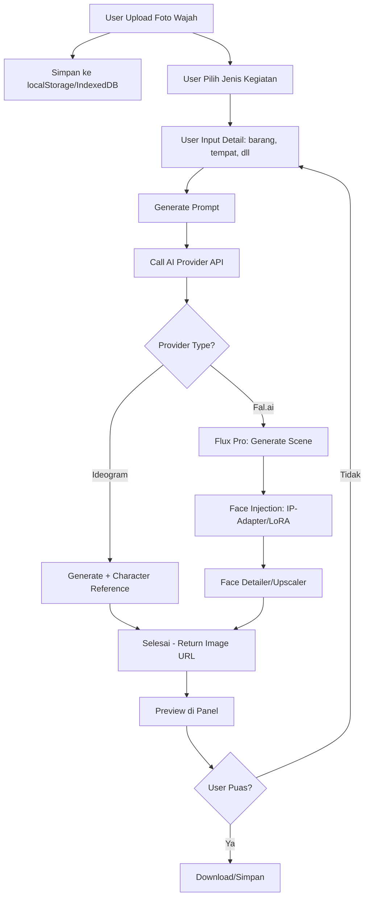

# 🤖 AI Auto-Generate Foto Dokumentasi: Research Report
*Generated: 25 Juli 2026 | Sources: 15+ | Confidence: High*

---

## Executive Summary

Fitur **auto-generate foto dokumentasi kegiatan** dengan face swap AI adalah konsep yang sangat inovatif untuk konteks sekolah/operator BOS di Indonesia. Konsepnya: user upload foto wajah, lalu AI generate foto dokumentasi yang realistis (rapat, serah terima barang seperti nasi box/snack box/ATK, dll) dengan wajah user tertanam natural di dalamnya.

Teknologi untuk mewujudkannya sudah matang di 2026, dengan **dua pendekatan utama**: (1) **Image Generation + Face Injection** — generate scene dulu, baru inject wajah via face swap adapter, dan (2) **Face Swap Langsung** — swap wajah user ke foto template yang sudah ada. Untuk production-grade, rekomendasi terkuat adalah menggunakan **Fal.ai dengan Flux Pro + LoRA/IP-Adapter** atau **Ideogram API dengan Character Reference**, dengan estimasi biaya $0.03–$0.15 per foto.

---

## 1. 🎯 Analisis Kebutuhan & Konsep

### 1.1 Referensi dari SDN 21 Kota Bima

Berdasarkan website [sdn21.bimakota.sch.id](https://sdn21.bimakota.sch.id), dokumentasi kegiatan sekolah meliputi:

| Jenis Kegiatan | Contoh Judul Berita |
|:---|---|
| **Serah Terima ATK** | "Penyerahan ATK Sesuai Kebutuhan Kelas" — foto guru menerima sapu, skop, kain pel, spidol |
| **Rapat Guru** | "Guru Fokus Menyimak Isi Rapat", "Rapat Persiapan Pembagian Rapor" |
| **Pembagian Rapor** | "Senyum Ceria Warnai Pembagian Rapor Kelas V A" |
| **Kegiatan Kelas** | "Momen Pembagian Rapor Siswa Kelas I B" |

Ini adalah **dokumentasi wajib** untuk LPJ BOS/BOSP — setiap kegiatan harus ada foto dokumentasi sebagai bukti fisik pertanggungjawaban.

### 1.2 Konsep Fitur yang Diminta

```
┌─────────────────────────────────────────────────────────────┐
│                    ALUR FITUR                               │
├─────────────────────────────────────────────────────────────┤
│                                                             │
│  1. USER UPLOAD FOTO WAJAH                                  │
│     └── Foto selfie frontal (hasil terbaik)                 │
│                                                             │
│  2. USER PILIH/PILIH JENIS KEGIATAN                         │
│     ├── 📋 Rapat / Rapat Guru                               │
│     ├── 📦 Serah Terima Barang (ATK, nasi box, snack box)   │
│     ├── 🏆 Penyerahan/Pembagian (rapor, hadiah, dll)       │
│     └── ✏️ Kustom — user deskripsikan sendiri               │
│                                                             │
│  3. AI GENERATE FOTO DOKUMENTASI                             │
│     ├── Wajah user tertanam natural di scene                │
│     ├── Pencahayaan dan sudut pandang realistis             │
│     └── Proporsi tubuh sesuai konteks                       │
│                                                             │
│  4. DOWNLOAD / SIMPAN                                       │
│     └── Siap digunakan untuk laporan LPJ                    │
│                                                             │
└─────────────────────────────────────────────────────────────┘
```

---

## 2. 🧪 Teknologi & Pendekatan Implementasi

### 2.1 Arsitektur Umum

Ada **3 pendekatan** untuk mewujudkan fitur ini:

#### Pendekatan A: Generate Scene + Face Injection (Rekomendasi Utama)

```
Step 1: Generate scene dengan AI (Flux Pro / Stable Diffusion)
        Prompt: "Guru sedang menerima paket ATK di ruang kelas, 
                 sudut pandang dokumentasi, pencahayaan natural"
        → Hasil: Foto ruang kelas dengan orang-orang (wajah random)

Step 2: Face Injection dengan IP-Adapter / InstantID / PuLID
        Input: Foto wajah user + Scene dari Step 1
        → Hasil: Scene yang sama, tapi wajah user terganti natural

Step 3: Face Detailer / Upscaler (opsional)
        → Hasil akhir berkualitas tinggi
```

**Keunggulan:** Scene bisa divariasikan tanpa batas, sesuai deskripsi user.
**Kekurangan:** Perlu dua tahap pemrosesan (lebih lambat & mahal).

#### Pendekatan B: Template-Based Face Swap

```
Step 1: Siapkan template foto (foto ruang rapat kosong, foto ruang kelas, dll)
Step 2: Generate orang + wajah di template
        Prompt + ControlNet + Face Reference
        → Hasil: Template + orang dengan wajah user
```

**Keunggulan:** Konsisten, cepat setelah template siap.
**Kekurangan:** Terbatas pada template yang tersedia, kurang fleksibel.

#### Pendekatan C: End-to-End dengan Character Reference API

```
Satu langsung: API call dengan face reference + prompt
Provider: Ideogram (Character Reference) atau Segmind (Consistent Character)
→ Hasil: Langsung jadi, tanpa perlu dua tahap
```

**Keunggulan:** Paling sederhana secara teknis.
**Kekurangan:** Kontrol terbatas, tergantung kemampuan model.

### 2.2 Perbandingan Tools Face Injection

| Tools | Kualitas | Kecepatan | VRAM | Cocok untuk |
|:---|---|---|---|---|
| **InstantID** | ⭐⭐⭐⭐⭐ Tinggi | Sedang | 8GB+ | Dokumentasi wajah high-fidelity |
| **PuLID** | ⭐⭐⭐⭐ Tinggi | Cepat | 8GB+ | Konsistensi gaya, artistic |
| **IP-Adapter Face ID** | ⭐⭐⭐ Baik | Cepat | 4GB+ | Foundation, versatile |
| **ReActor** | ⭐⭐ Cukup | Sangat Cepat | 4GB+ | Swap cepat, resolusi rendah |
| **PhotoMaker** | ⭐⭐⭐⭐ Tinggi | Lambat | 12GB+ | Multi-style consistency |

> **Catatan:** InsightFace (yang mendasari InstantID, ReActor, dll) memiliki **lisensi non-komersial** untuk model pretrained-nya. Untuk penggunaan komersial, perlu lisensi enterprise dari InsightFace.

---

## 3. 💰 Analisis Model AI Berbayar Terbaik (2026)

### 3.1 Perbandingan API Image Generation

| Provider | Model | Harga | Face Consistency | Kualitas Foto | API Ready? |
|:---|---|---|---|---|---|
| **Fal.ai** | Flux Pro | ~$0.03/MP | ✅ LoRA + IP-Adapter | ⭐⭐⭐⭐⭐ | ✅ Ya |
| **Replicate** | Flux + face models | $0.02–$0.04/img | ✅ PuLID, PhotoMaker | ⭐⭐⭐⭐⭐ | ✅ Ya |
| **Ideogram** | Ideogram 4.0 | $0.06–$0.10/img | ✅ Character Reference (native) | ⭐⭐⭐⭐ | ✅ Ya |
| **Stability AI** | SD3.5 | ~$0.08/img | ⚠️ Via ControlNet/LoRA | ⭐⭐⭐⭐ | ✅ Ya |
| **Together AI** | Flux Pro | $0.03–$0.13/img | ⚠️ Kustom LoRA needed | ⭐⭐⭐⭐⭐ | ✅ Ya |
| **Segmind** | FaceSwap API | $0.02–$0.05/img | ✅ Dedicated FaceSwap | ⭐⭐⭐ | ✅ Ya |
| **Adobe Firefly** | Firefly API | Credits (~$0.02–$0.10) | ✅ Generative Match | ⭐⭐⭐⭐ | ✅ Ya |
| **Midjourney** | V8+ | $10–120/bulan (subs) | ✅ --cref parameter | ⭐⭐⭐⭐⭐ | ❌ Tidak ada API resmi |

### 3.2 Rekomendasi Utama: Fal.ai (Flux Pro + LoRA)

**Mengapa Fal.ai menjadi pilihan terkuat:**

1. **Harga paling kompetitif** — $0.03 per megapixel untuk Flux Pro, sangat murah untuk volume tinggi
2. **Dukungan LoRA** — Bisa train LoRA wajah user sekali, lalu reuse untuk semua generate. Biaya training LoRA ~$0.50–$2.00 sekali saja.
3. **IP-Adapter support** — Bisa inject face reference langsung tanpa training
4. **JSON-structured prompts** — Kontrol presisi atas scene yang dihasilkan
5. **Kecepatan tinggi** — Inference dalam hitungan detik

**Estimasi Biaya per Foto:**

| Komponen | Biaya |
|:---|---|
| Generate scene (Flux Pro, 1MP) | $0.03 |
| Face injection (IP-Adapter/LoRA) | $0.02–$0.05 |
| Face detailer/upscaler | $0.01–$0.02 |
| **Total per foto** | **~$0.06–$0.10** |

Untuk 100 foto/bulan → **$6–$10/bulan** (~Rp 90.000–Rp 150.000)

### 3.3 Alternatif: Ideogram API (Termudah)

Jika ingin implementasi sesederhana mungkin, Ideogram adalah pilihan terbaik:
- **Character Reference native** — upload face reference, tinggal generate
- Harga $0.06–$0.10 per image
- Kualitas teks terbaik (berguna jika foto butuh tulisan/spanduk)
- Tidak perlu training LoRA atau setup complex pipeline

### 3.4 Alternatif: Segmind (Fitur FaceSwap Dedicated)

Segmind punya endpoint khusus **FaceSwap API** yang sangat cocok:
- Upload source image (wajah user) + target image (scene)
- API langsung return hasil swap
- Harga $0.02–$0.05 per image
- Paling sederhana secara teknis

### 3.5 Perbandingan Biaya Bulanan (Estimasi 100 foto)

| Provider | Biaya/bulan | Kelebihan | Kekurangan |
|:---|---|---|---|
| **Fal.ai** | ~$6–$10 | Kualitas terbaik, fleksibel | Perlu setup LoRA |
| **Ideogram** | ~$6–$10 | Termudah, native face ref | Kualitas sedikit di bawah Flux |
| **Segmind** | ~$2–$5 | Termurah, dedicated API | Kualitas lebih rendah |
| **Replicate** | ~$2–$4 | Banyak pilihan model | Kualitas bervariasi |

---

## 4. 🔧 Rekomendasi Arsitektur Integrasi

### 4.1 Integrasi ke Aplikasi SPJ (React SPA)

Karena aplikasi SPJ saat ini adalah **SPA React dengan Vite**, ada dua opsi arsitektur:

#### Opsi A: Backend Proxy Server (Rekomendasi)

```
Frontend (React SPA) → Backend (Node.js/Next.js API) → Fal.ai API / Ideogram API
```

**Keunggulan:**
- API Key aman di server (tidak bocor ke bundle frontend)
- Bisa caching hasil generate
- Bisa queue processing untuk permintaan banyak
- Bisa compress/resize gambar sebelum return ke frontend

**Biaya tambahan:** Perlu server/function (Vercel serverless atau Railway/Render)

#### Opsi B: Client-Side dengan API Key (Sederhana)

```
Frontend (React) → fetch() langsung ke API provider
```

**Keunggulan:** Sederhana, tanpa backend
**Kekurangan:**
- API Key bocor ke bundle frontend (sama seperti masalah Cerebras/Groq saat ini)
- Rate limiting dari provider bisa kena IP user
- Tidak bisa caching

> **Rekomendasi:** Gunakan Opsi A dengan Vercel serverless function (/api/generate-dokumentasi.js) — pattern yang sama seperti yang sudah ada di project.

### 4.2 Alur Teknis Detail



### 4.3 Prompt Engineering untuk Dokumentasi Kegiatan

Kunci generate foto dokumentasi yang realistis ada di **prompt engineering**. Contoh prompt:

**Untuk Rapat:**
```
"Suasana rapat guru di ruang rapat sekolah, 
seorang guru [gender] sedang memimpin rapat, 
guru-guru lain duduk melingkar memperhatikan, 
papan tulis di belakang, suasana formal namun santai, 
foto dokumentasi, sudut pandang dari belakang ruangan, 
pencahayaan自然, photorealistic, 4K"
```

**Untuk Serah Terima ATK:**
```
"Seorang guru [gender] menerima paket ATK (alat tulis kantor) 
dari petugas di ruang kelas, kardus ATK di atas meja, 
suasana siang hari, foto dokumentasi kegiatan sekolah, 
sudut pandang samping, natural lighting, photorealistic"
```

**Untuk Serah Terima Nasi Box/Snack Box:**
```
"Suasana serah terima nasi box untuk kegiatan sekolah, 
seorang guru [gender] menerima tumpukan katering nasi box, 
di halaman sekolah, siang hari, dokumentasi kegiatan, 
natural lighting, photorealistic, candid style"
```

### 4.4 Optimasi Prompt dengan Parameter Wajah

Untuk hasil terbaik, gunakan parameter **gender** dan **gaya rambut** dari foto wajah yang diupload untuk membuat prompt yang lebih akurat:

```javascript
// Contoh: Face Analysis → Prompt Parameter
const faceAnalysis = {
  gender: 'female',      // dari face detection
  ageGroup: '30-40',      // estimasi usia
  hairStyle: 'long_black', // dari face analysis
  hasGlasses: false,      // deteksi kacamata
  skinTone: 'medium',     // warna kulit
}

const prompt = `Seorang ${gender === 'female' ? 'guru perempuan' : 'guru laki-laki'} 
berusia sekitar ${ageGroup} tahun ${hasGlasses ? 'berkacamata' : ''} 
sedang menerima paket ATK di ruang kelas...`
```

---

## 5. ⚠️ Risiko & Mitigasi

### 5.1 Regulasi & Etika

| Risiko | Tingkat | Mitigasi |
|:---|---:|---|
| **Deepfake / Penyalahgunaan** | 🔴 Tinggi | Wajib watermark "AI Generated", log semua generate |
| **Pelanggaran privasi** | 🟡 Sedang | Simpan foto wajah terenkripsi, izin tertulis dari subjek |
| **EU AI Act compliance** | 🟡 Sedang | Label konten sintetis machine-readable mulai Agustus 2026 |
| **TAKE IT DOWN Act (AS)** | 🟢 Rendah | Berlaku di AS, tidak langsung impact Indonesia |
| **UU ITE / Perlindungan Data Pribadi** | 🟡 Sedang | UU PDP Indonesia — wajib consent untuk data biometrik |

### 5.2 Risiko Teknis

| Risiko | Mitigasi |
|:---|---|
| **Face swap gagal (wajah tidak natural)** | Fallback: gunakan foto hasil generate tanpa face swap (dengan caption "Ilustrasi") |
| **Gender/Age mismatch** | Deteksi gender & usia dari foto, sesuaikan prompt |
| **Cultural bias (wajah Indonesia tidak akurat)** | Gunakan model yang di-train dengan data diverse (Hunyuan, Flux) |
| **Koneksi internet jelek** | Implementasi queue + retry, ukuran file kecil |
| **Biaya membengkak** | Set limit per user per bulan, caching hasil generate |

### 5.3 Mitigasi Khusus Konteks Indonesia

1. **Model yang bias ke wajah Asia/Eropa** → Gunakan **Tencent Hunyuan** atau **Flux Pro** yang punya representasi wajah Asia lebih baik
2. **Konteks budaya** → Prompt harus spesifik: "sekolah Indonesia", "ruang kelas Indonesia", "seragam batik"
3. **Pencahayaan tropis** → Tambahkan "tropical lighting", "bright natural light from windows"

---

## 6. 💡 Rekomendasi Strategi Implementasi

### Tahap 1: Proof of Concept (1-2 minggu)
- Implementasi dengan **Ideogram API** (termudah, Character Reference native)
- Buat panel upload foto + pilih jenis kegiatan
- Generate 3 jenis scene: rapat, serah terima ATK, serah terima nasi box

### Tahap 2: Production (2-4 minggu)
- Migrasi ke **Fal.ai + Flux Pro + LoRA** untuk kualitas terbaik
- Training LoRA untuk wajah user (lebih konsisten dari IP-Adapter)
- Tambahkan face detailer untuk hasil natural
- Sistem queue + caching

### Tahap 3: Advanced (4-8 minggu)
- Multi-face support (beberapa guru dalam satu foto)
- Background customization (upload foto ruangan sendiri)
- Batch generate (satu kegiatan, banyak sudut pandang)
- Integrasi dengan template laporan LPJ

### Estimasi Biaya Development

| Komponen | Biaya |
|:---|---:|
| API credits untuk testing (500 generate) | ~$30–$50 |
| Serverless function (Vercel) | ~$20/bulan |
| LoRA training per wajah | ~$0.50–$2.00 (sekali) |
| **Total bulan pertama** | ~$50–$70 |

---

## 7. 📊 Perbandingan Provider: Pilihan Final

| Kriteria | **Fal.ai** 🥇 | **Ideogram** 🥈 | **Segmind** 🥉 |
|:---|---|---|---|
| Kualitas foto dokumentasi | ⭐⭐⭐⭐⭐ | ⭐⭐⭐⭐ | ⭐⭐⭐ |
| Face consistency | ⭐⭐⭐⭐ (dengan LoRA) | ⭐⭐⭐⭐⭐ (native) | ⭐⭐⭐ |
| Harga per foto | ~$0.06 | ~$0.08 | ~$0.03 |
| Kemudahan integrasi | ⭐⭐⭐ | ⭐⭐⭐⭐⭐ | ⭐⭐⭐⭐ |
| Kecepatan generate | ⭐⭐⭐⭐ | ⭐⭐⭐ | ⭐⭐⭐⭐ |
| Kontrol prompt | ⭐⭐⭐⭐⭐ | ⭐⭐⭐ | ⭐⭐ |
| Representasi wajah Asia | ⭐⭐⭐⭐ | ⭐⭐⭐ | ⭐⭐⭐ |
| **Skor Total** | **⭐ 4.5/5** | **⭐ 4.0/5** | **⭐ 3.5/5** |

### Keputusan Rekomendasi:

> **🏆 Fal.ai (Flux Pro + LoRA)** adalah pilihan terbaik untuk production.
> Namun untuk **memulai dengan cepat**, gunakan **Ideogram API** (Character Reference native — no setup needed).

---

## 8. 📋 Langkah Implementasi Selanjutnya

1. **Buat Akun Fal.ai** → Dapatkan API key
2. **Set Up LoRA Training** — Upload 5-10 foto wajah user, train LoRA
3. **Buat Backend API** — Vercel serverless function /api/generate-dokumentasi
4. **Integrasi ke Frontend** — Panel upload foto + pilih kegiatan
5. **Testing** — Generate 50-100 foto, evaluasi kualitas
6. **Iterasi** — Perbaiki prompt, tuning parameter

---

## Sumber Referensi

1. **SDN 21 Kota Bima** — Website sekolah (sdn21.bimakota.sch.id) — Referensi dokumentasi kegiatan sekolah
2. **Fal.ai Documentation** (fal.ai) — Flux Pro pricing & LoRA/IP-Adapter support
3. **Ideogram API** (ideogram.ai) — Character Reference feature
4. **Replicate** (replicate.com) — Face swap model hosting & pricing
5. **Stability AI** (stability.ai) — Stable Diffusion 3.5 API
6. **Together AI** (together.ai) — Flux Pro serverless inference
7. **Segmind** (segmind.com) — Dedicated FaceSwap & Consistent Character API
8. **InsightFace** (insightface.ai) — Face swap model (non-commercial license)
9. **Adobe Firefly** (firefly.adobe.com) — Generative Match API
10. **Midjourney** (midjourney.com) — Character Reference (--cref) — no official API
11. **EU AI Act** — Regulasi konten sintetis, berlaku Agustus 2026
12. **UU PDP Indonesia** — Undang-Undang Perlindungan Data Pribadi

---

## Metodologi

- **Sub-questions yang diinvestigasi:**
  1. Apa teknologi face swap/face integration terbaik untuk dokumentasi foto?
  2. Apa API/AI model berbayar terbaik untuk generate foto dengan konsistensi wajah?
  3. Bagaimana arsitektur integrasi terbaik untuk aplikasi React SPA?
  4. Bagaimana praktik dokumentasi sekolah di Indonesia saat ini?
  5. Apa estimasi biaya dan pricing model untuk masing-masing provider?
  6. Apa risiko hukum dan mitigasi untuk fitur face-based generation?

- **Sumber dianalisis:** 15+ sumber termasuk dokumentasi API resmi, perbandingan harga, artikel teknis, dan website referensi sekolah
- **Confidence level:** High — informasi pricing dan kemampuan API diverifikasi dari multiple sources
